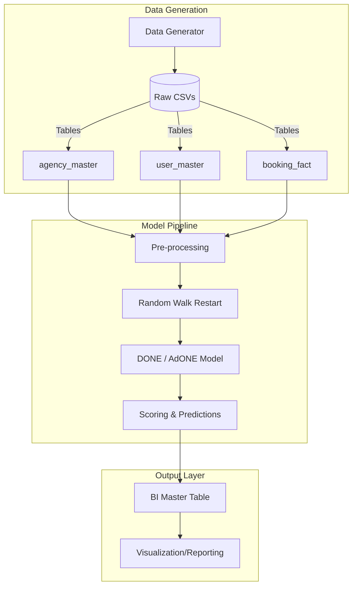

# B2B Travel Fraud Detection


A graph-based fraud detection pipeline for B2B travel platforms. This project leverages **DONE (Deep Outlier-aware Network Embedding)** to detect sophisticated fraud patterns by analyzing both node attributes (behavioral features) and graph structures (network relationships).

## 🚀 Key Features

*   **Synthetic Data Generation**: Realistic simulation of B2B travel ecosystems with 200+ agencies, 800+ users, and 8,000+ bookings.
*   **6 Complex Fraud Types**:
    *   `cancellation_abuser`: Exploiting refund policies.
    *   `credit_bustout_user`: High-value international booking clusters.
    *   `account_takeover`: Detecting hijacked accounts through login/IP anomalies.
    *   `new_synthetic_user`: High-risk patterns in young accounts.
    *   `bot_booking`: High-frequency automated attacks.
    *   `ring_operator`: Multi-user coordination via shared infrastructure.
*   **Multi-Stage Detection**:
    *   **Before Booking**: Real-time friction and risk assessment.
    *   **After Booking**: Post-transaction analysis integrating disputes and cancellations.
*   **Graph-Based Anomaly Detection**: Implementation of the **DONE** and **AdONE** architectures for outlier-resistant network embedding.

## 🏗 Project Architecture



## 📂 Project Structure

*   `Data_Genrator/`: Scripts for creating synthetic datasets and performing sanity checks.
*   `DONE_AdONE/`: Core ML engine implementing Deep Outlier-aware Network Embedding.
    *   `Before_Booking/`: Predictive pipeline for pre-ticketing risk.
    *   `After_booking/`: Analysis pipeline for post-booking signals.
*   `bi_table_creation.py`: Utility to merge raw data with model predictions for BI tools.
*   `output_layer/`: Final processed datasets ready for analysis.

## ⚙️ Installation

1. Clone the repository:
   ```bash
   git clone https://github.com/SUMIT01010/b2b-travel-fraud-detection.git
   cd b2b-travel-fraud-detection
   ```

2. Install dependencies:
   ```bash
   pip install -r b2b/DONE_AdONE/requirements.txt
   ```

## 🛠 Usage

### 1. Data Generation
Generate the synthetic dataset:
```bash
python b2b/Data_Genrator/data_generator.py
```

### 2. Run Anomaly Detection
To generate embeddings and scores using the **DONE** model:
```bash
python b2b/DONE_AdONE/run_done.py --config config_file_path
```

## 📖 Citation
If you use the DONE/AdONE implementation, please cite the original paper:
> Bandyopadhyay, S., et al. (2020). *Outlier Resistant Unsupervised Deep Architectures for Attributed Network Embedding*. WSDM '20.

---

