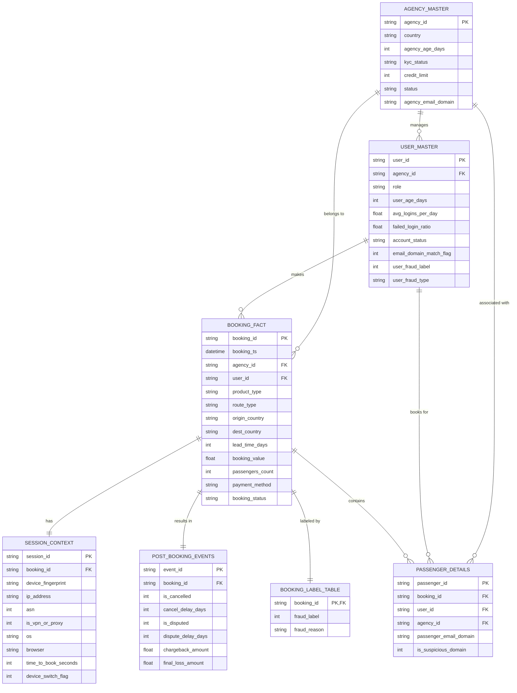

# ER Diagram - B2B Travel Fraud Detection

The following Mermaid diagram represents the relationships between the tables generated by `data_generator.py`.

```mermaid
erDiagram
    AGENCY_MASTER ||--o{ USER_MASTER : "manages"
    AGENCY_MASTER ||--o{ BOOKING_FACT : "belongs to"
    AGENCY_MASTER ||--o{ PASSENGER_DETAILS : "associated with"
    
    USER_MASTER ||--o{ BOOKING_FACT : "makes"
    USER_MASTER ||--o{ PASSENGER_DETAILS : "books for"
    
    BOOKING_FACT ||--|| SESSION_CONTEXT : "has"
    BOOKING_FACT ||--o{ PASSENGER_DETAILS : "contains"
    BOOKING_FACT ||--|| POST_BOOKING_EVENTS : "results in"
    BOOKING_FACT ||--|| BOOKING_LABEL_TABLE : "labeled by"

    AGENCY_MASTER {
        string agency_id PK
        string country
        int agency_age_days
        string kyc_status
        int credit_limit
        string status
        string agency_email_domain
    }

    USER_MASTER {
        string user_id PK
        string agency_id FK
        string role
        int user_age_days
        float avg_logins_per_day
        float failed_login_ratio
        string account_status
        int email_domain_match_flag
        int user_fraud_label
        string user_fraud_type
    }

    BOOKING_FACT {
        string booking_id PK
        datetime booking_ts
        string agency_id FK
        string user_id FK
        string product_type
        string route_type
        string origin_country
        string dest_country
        int lead_time_days
        float booking_value
        int passengers_count
        string payment_method
        string booking_status
    }

    SESSION_CONTEXT {
        string session_id PK
        string booking_id FK
        string device_fingerprint
        string ip_address
        int asn
        int is_vpn_or_proxy
        string os
        string browser
        int time_to_book_seconds
        int device_switch_flag
    }

    PASSENGER_DETAILS {
        string passenger_id PK
        string booking_id FK
        string user_id FK
        string agency_id FK
        string passenger_email_domain
        int is_suspicious_domain
    }

    POST_BOOKING_EVENTS {
        string event_id PK
        string booking_id FK
        int is_cancelled
        int cancel_delay_days
        int is_disputed
        int dispute_delay_days
        float chargeback_amount
        float final_loss_amount
    }

    BOOKING_LABEL_TABLE {
        string booking_id PK, FK
        int fraud_label
        string fraud_reason
    }
```
