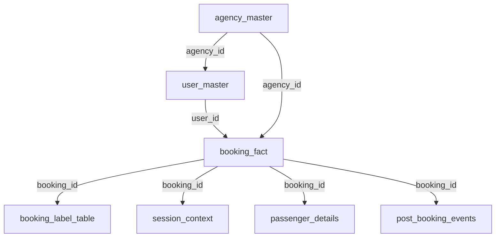

# B2B Travel Fraud Detection — Code Walkthrough

## Tables Generated

The `DataGenerator.ipynb` creates **7 tables** linked via `booking_id`, `user_id`, and `agency_id`:

| Table | Key Columns | Rows |
|---|---|---|
| `agency_master` | `agency_id`, country, KYC, credit_limit | 200 |
| `user_master` | `user_id`, `agency_id`, fraud_label, fraud_type | 800 (40 fraud) |
| `booking_fact` | `booking_id`, `user_id`, `agency_id`, value, route | 8000 (720 fraud) |
| `session_context` | `booking_id`, fingerprint, IP, VPN flag | 8000 |
| `passenger_details` | `booking_id`, passenger_email_domain | ~24000 |
| `post_booking_events` | `booking_id`, cancelled, disputed, loss | 8000 |
| `booking_label_table` | `booking_id`, fraud_label, fraud_reason | 8000 |

---

## DataGenerator.ipynb — Cell-by-Cell

| Cell | Purpose |
|---|---|
| **0** | Imports, config (seeds, counts), helper functions |
| **1** | `agency_master` — 200 agencies with KYC, credit limits, domains |
| **2** | `user_master` — 800 users (40 fraud), 6 fraud types with type-specific behavioral signals |
| **3** | `booking_fact` — 8000 bookings, 720 assigned to fraud users |
| **4** | `session_context` — Device/IP/VPN per booking with shared-infra and IP-masking patterns |
| **5** | `passenger_details` — Email domains per passenger (fraud → throwaway/generic) |
| **6** | `post_booking_events` — Cancellations/disputes with fraud-type-specific probabilities |
| **7** | `booking_label_table` — Ground truth labels with human-readable fraud reasons |
| **8** | Save CSVs + **sanity checks** (see below) |

### 6 Fraud Types

| Type | Key Signal |
|---|---|
| `cancellation_abuser` | Abnormally high cancel rate (70–88%) |
| `credit_bustout_user` | High-value international bookings, disputes, financial loss |
| `account_takeover` | High failed login ratio, new devices/IPs |
| `new_synthetic_user` | Very young accounts (3–40 days), risky infra |
| `bot_booking` | Extremely high login frequency (25–60/day) |
| `ring_operator` | Shared devices/IPs across multiple fraud users |

---

## Cell 8 — Sanity Checks (Cross-Table Consistency)

### A. Basic Structural Checks
- No legacy columns (`device_id`, `ip_id`)
- Fingerprint → OS/Browser is 1:1
- VPN flag derived solely from ASN

### B. Referential Integrity
- `booking_id` sets match exactly across `booking_fact` ↔ `booking_label_table` ↔ `session_context` ↔ `post_booking_events` ↔ `passenger_details`
- All `user_id`s and `agency_id`s in `booking_fact` exist in their master tables
- All `agency_id`s in `user_master` exist in `agency_master`

### C. Cross-Table Fraud Label Consistency
- **C1**: Every fraud booking → belongs to a fraud-labeled user
- **C2**: Reports if fraud users also have good bookings (by design, they can)
- **C3**: `agency_id` in `booking_fact` matches `agency_id` in `user_master` for same user
- **C4**: `fraud_reason` text aligns with `user_fraud_type` (e.g., "credit bustout" reason → `credit_bustout_user` type)

### D. Post-Booking Events ↔ Fraud Type
- `cancellation_abuser` bookings have elevated cancel rate vs overall
- `credit_bustout_user` bookings have elevated dispute rate vs overall
- Fraud bookings overall have higher cancel/dispute rates than good bookings

### E. Session Context ↔ Fraud Labels
- Fraud bookings have higher VPN/proxy usage rate
- Fraud bookings have higher IP diversity per device (IP masking signal)

### F. Passenger Details ↔ Fraud Labels
- Good bookings have higher agency-email domain match rate
- Fraud bookings have higher throwaway email domain usage

---

## Fraud_vs_good_users.ipynb

**Purpose**: User-level exploratory comparison of fraud vs good users.

Merges all tables → aggregates to user-level metrics → for each fraud type, shows **top 8 worst fraud users** vs **good user average** on type-relevant columns:

| Fraud Type | Columns Shown |
|---|---|
| `cancellation_abuser` | total_bookings, cancels, cancel_rate |
| `account_takeover` | failed_login_ratio, avg_logins, unique_ips, proxy_rate |
| `new_synthetic_user` | user_age_days, total_bookings, proxy_rate, unique_ips |
| `credit_bustout_user` | max_booking_value, avg_booking_value, disputes, total_loss |
| `bot_booking` | avg_logins, total_bookings, unique_ips |
| `ring_operator` | unique_ips, proxy_rate, total_bookings |

---

## Fraud_vs_good_bookings.ipynb

**Purpose**: Booking-level exploratory comparison of fraud vs good bookings.

Same merge approach, but aggregated at booking group level (by `fraud_reason`). For each fraud reason, prints a comparison table showing fraud booking stats vs good booking baseline across metrics like booking value, cancellation rate, dispute rate, VPN usage, IP/device churn, and lead time.
